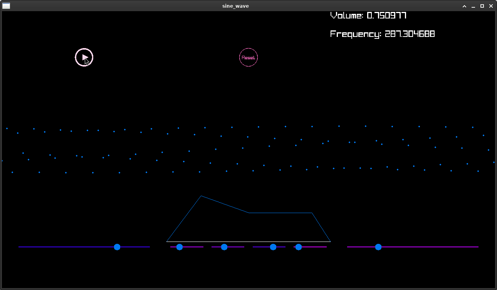

# Info
- WIP
- build a small synthesizer in a collorborative way
- synth consist of:
  - signal generation
  - output through Jack
  - output on GUI via Raylib
  - controlling with GUI elements (slider, buttons)
- purpose is learning interaction between GUI and a synth engine

# TODO
 - apply concepts like Model View Controller

# Ideas
 - hot code reload to comfortable edit UI
 - generate video of UI using ffmpeg
 - light saber effect for adsr progress function

# Usage

- plot sine wave data from `consumer_producer_sine_wave` script:
```
 ./consumer_producer_sine_wave|gnuplot -p -e "set xrange[0:87040]; plot '-' "
```


