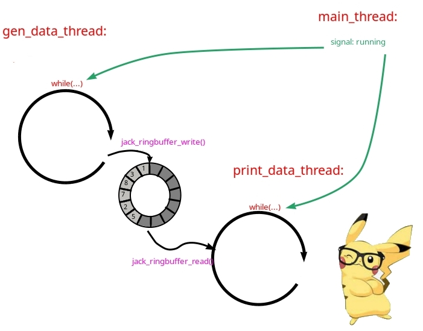

# Info
- overview over architecture patterns

## consumer_producer_with_buf.c
- - 
- producer:
  - generates data
  - here: gen_data_thread_fct(...)
- consumer:
  - reads data from ringbuffer
  - here: print_data_thread_fct(...)
  - prints it
- additional controller:
  - here main(...) function
  - sends signal to stop (running variable)
